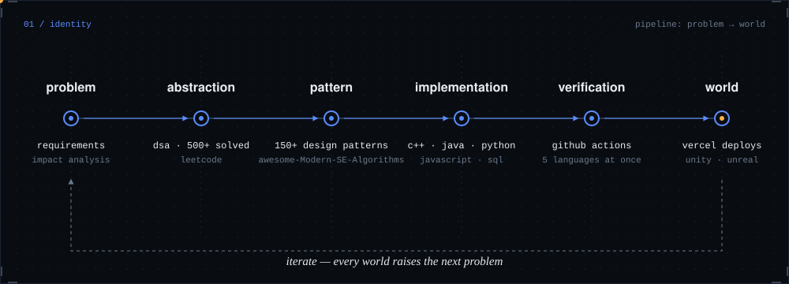
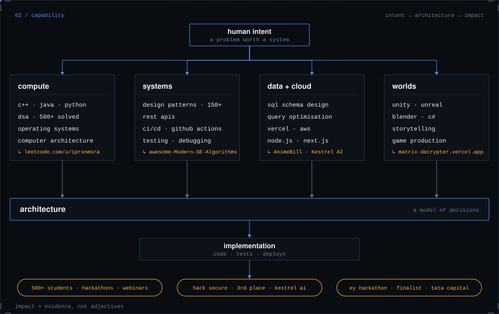
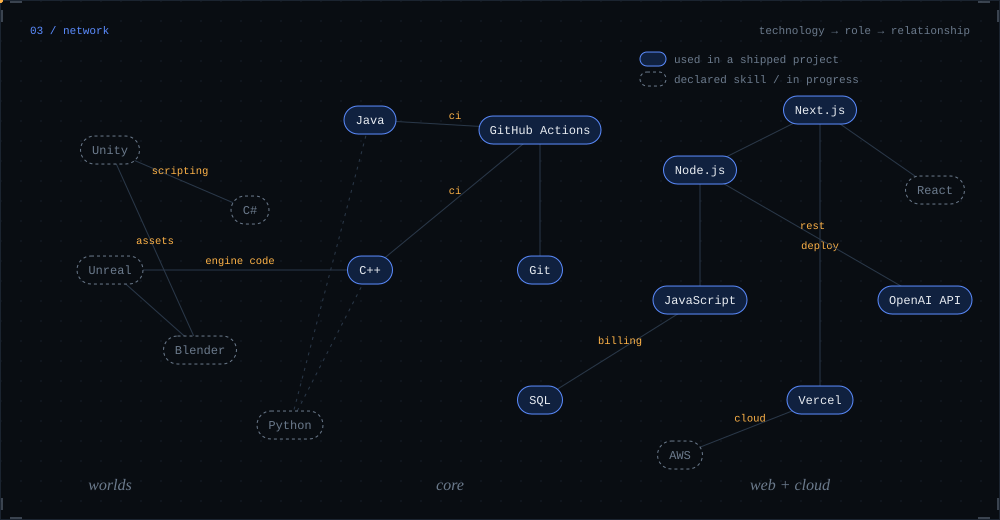
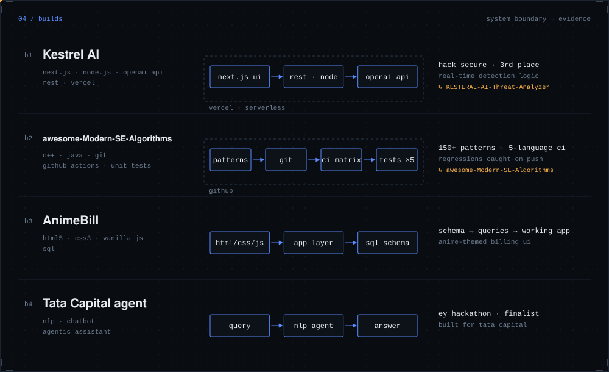
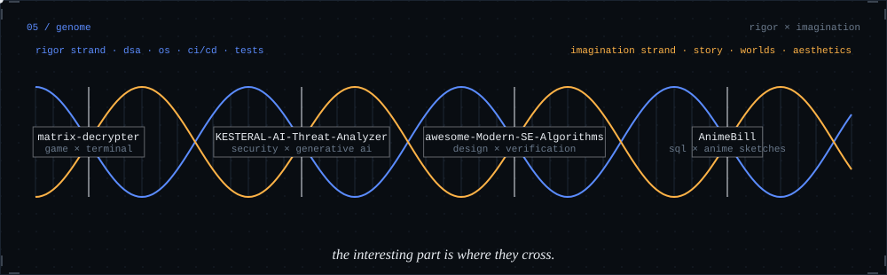
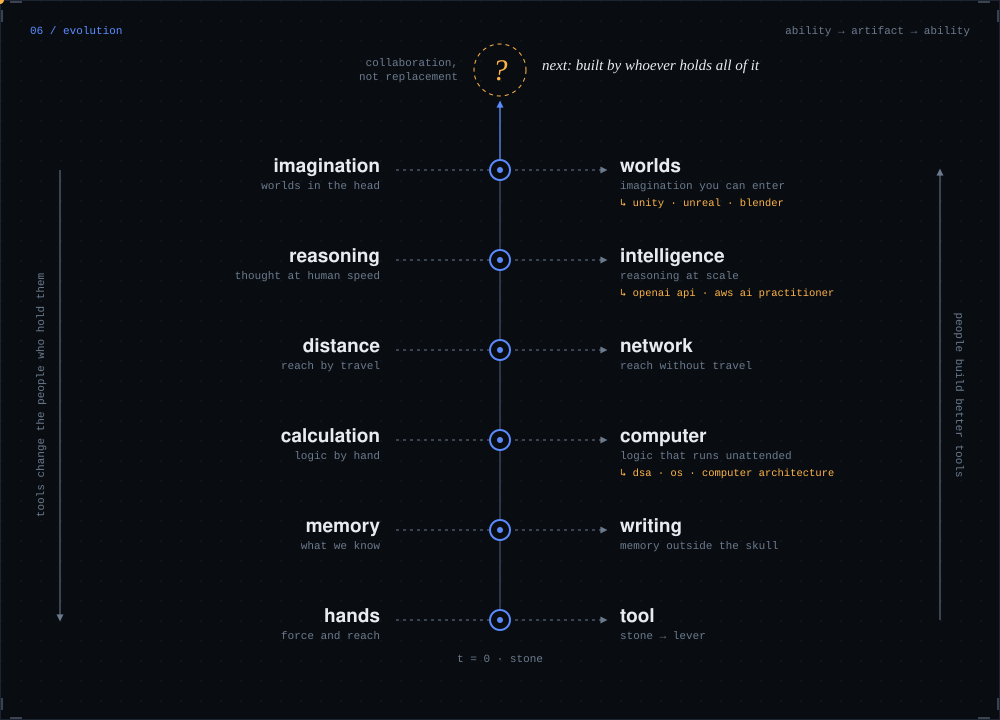
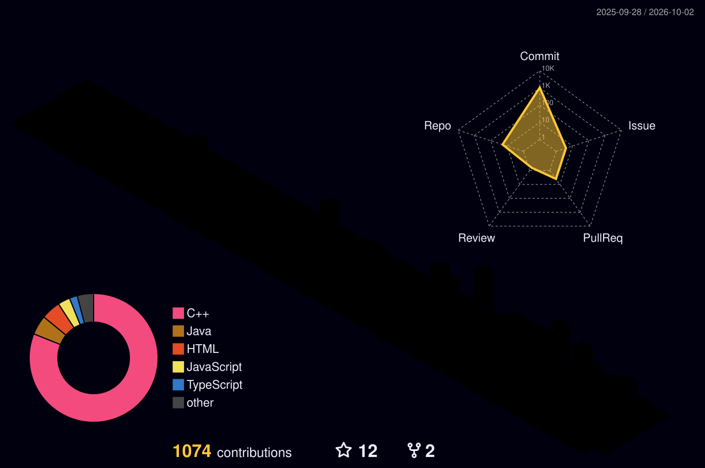
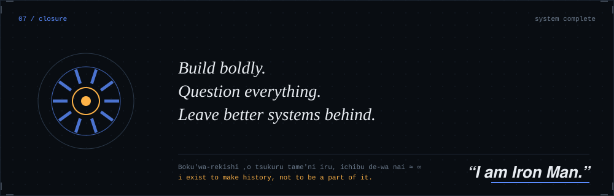

<!--
  signal check: you're reading the source. hi.
  every diagram below is a hand-built SVG in /assets (generated by tools/build.py).
-->


<sub>**find me →** [GitHub](https://github.com/iprsnmsra) / [LinkedIn](https://www.linkedin.com/in/iprsnmsra/) / [LeetCode](https://leetcode.com/u/iprsnmsra/) / [Email](mailto:prasoonmishra9c@gmail.com) / [@Zovrith](https://github.com/Zovrith)</sub>

<br>



I like the part of engineering where a messy problem becomes a clean abstraction, then a pattern, then something that runs, passes tests, and ships. Algorithms are how I think. Games are where I want that thinking to live.

<br>



<details>
<summary><b>evidence for each column</b></summary>

| capability | what's behind it | where to look |
| --- | --- | --- |
| compute | C++, Java, Python · DSA, OS, computer architecture · 500+ LeetCode problems (C++ and Java) | [LeetCode](https://leetcode.com/u/iprsnmsra/) |
| systems | 150+ design patterns, unit tests, CI/CD on GitHub Actions, REST APIs, debugging and performance tuning | [awesome-Modern-SE-Algorithms](https://github.com/iprsnmsra/awesome-Modern-SE-Algorithms) |
| data + cloud | SQL schema design and queries, Node.js, Next.js, Vercel deployments, AWS | [KESTERAL-AI-Threat-Analyzer](https://github.com/iprsnmsra/KESTERAL-AI-Threat-Analyzer) |
| worlds | Unity, Unreal Engine, Blender, C# and C++ scripting, storytelling and game production | [Matrix Decrypter](https://matrix-decrypter.vercel.app/) |
| impact | 500+ students reached through hackathons (Dawn of Code) and webinars · Hack Secure 3rd place · EY Hackathon finalist | |

</details>

<br>



<sub>Solid = used in a project I shipped. Dashed = skills I'm building or haven't shipped with yet. I'd rather show you the difference.</sub>

<br>



<details>
<summary><b>build notes</b></summary>

**[Kestrel AI](https://github.com/iprsnmsra/KESTERAL-AI-Threat-Analyzer)** — generative-AI threat analysis. A Next.js front end talks to a Node REST layer that calls the OpenAI API, deployed serverless on Vercel. I designed the architecture and tuned and debugged the deployment while testing the detection logic. **3rd place, Hack Secure.**

**[awesome-Modern-SE-Algorithms](https://github.com/iprsnmsra/awesome-Modern-SE-Algorithms)** — 150+ system design patterns in C++ and Java. A GitHub Actions pipeline runs the tests across five languages on every change so regressions show up immediately.

**AnimeBill** — a retail e-bill generator. I modelled the SQL schema for transactions and billing records, wrote the queries, and built the app layer in vanilla JS with an anime-sketch theme.

**Tata Capital agent** — an NLP chatbot prototype, built for the EY Hackathon, where it reached the **finals**.

</details>

<br>



<br>



People keep moving what they can do out of their heads and hands and into things. Memory became writing, arithmetic became machines, reach became networks, imagination became worlds you can walk into. Then we built tools that help build better tools. I don't read that as technology replacing people. I read it as people extending themselves, and I want to be one of the people doing the extending.

<br>

```text
SYSTEM STATUS
status        building
focus         LeetCode + HackerRank problem solving · advanced animation
role          Student Ambassador, Google · Campus Ambassador, HackerRank
learning      ServiceNow platform administration (virtual intern, Apr–Jun 2026)
community     MERN Matrix Club, VIT Bhopal (co-lead, Nov 2024 – Jul 2026)
credentials   Oracle Certified Java Associate · AWS AI Practitioner · NPTEL IoT (Silver)
trajectory    B.Tech CSE, Gaming Technology → Sept 2028
```

<details>
<summary><b>activity trace</b></summary>
<br>



</details>

<br>

<sub>**signal channels**</sub>
<br>
<sub>GitHub → [iprsnmsra](https://github.com/iprsnmsra) &nbsp;/&nbsp; LinkedIn → [in/iprsnmsra](https://www.linkedin.com/in/iprsnmsra/) &nbsp;/&nbsp; Email → [prasoonmishra9c@gmail.com](mailto:prasoonmishra9c@gmail.com)</sub>


